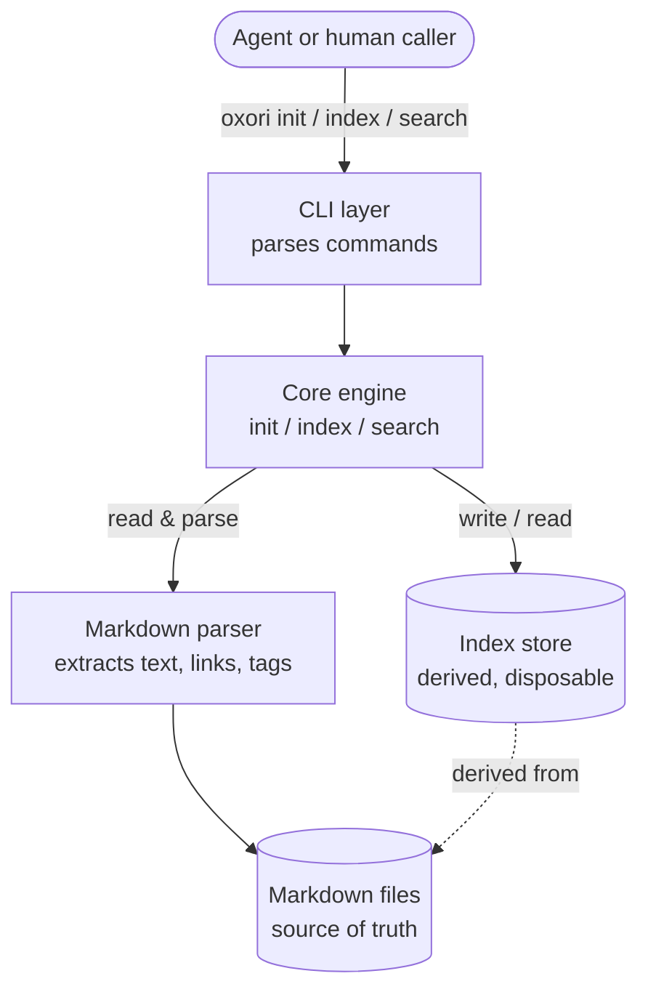
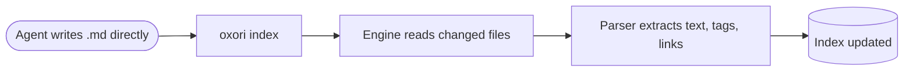
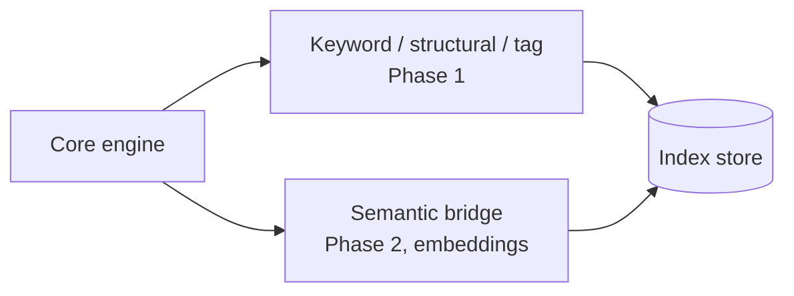

# Oxori — High-Level Architecture

> Conceptual view. Components and how they talk — not file names, signatures, or storage formats. Those live in the low-level doc.
> Companion to VISION.md (why) and DECISIONS.md (what we decided).

---

## The shape in one picture



The dashed line is the rule that holds everything together: **the index is always derived from the markdown.** The markdown is the truth; the index is a fast, throwaway view of it.

---

## The components

**CLI layer.** The thin outer shell. It understands `oxori init`, `oxori index`, `oxori search`, parses arguments, and hands off to the engine. It holds no logic of its own — it only translates a command line into an engine call and formats the engine's answer for output. This is the surface an agent talks to.

**Core engine.** Where the three operations live: setting up a vault (`init`), bringing the index up to date with the markdown (`index`), and answering queries (`search`). The engine coordinates the parser, the index store, and the filesystem. It is the only component that knows *what Oxori does*; everything around it is mechanism.

**Markdown parser.** Reads markdown files and pulls out the three things Oxori cares about: the **body text** (for full-text keyword search), the **tags** (`#tag`), and the **links** (`[[...]]`, which form the graph and its backlinks). It follows the Obsidian convention so a human opening the same vault sees the same structure. The parser interprets markdown; it never writes it.

**Index store.** Holds the derived representation the engine searches against: full text per file, tags, and the link graph. It can be deleted and rebuilt from the markdown at any time. Search reads from here so it never has to scan every file. (Its physical format — how full text and graph are stored — is a low-level decision.)

**Markdown files.** The actual `/oxori` vault. The single source of truth. Agents write here directly; Oxori reads here. Nothing in the index is authoritative over what these files say.

---

## The two flows

Everything Oxori does is one of two paths.

### Write / update flow

An agent writes or edits a markdown file directly in the vault — Oxori is not involved in writing. The agent then calls `oxori index`, and the engine reconciles the index with what changed on disk.



Oxori stays passive here: it doesn't decide what to write or whether it's correct. It only records what is now on disk.

### Read / search flow

A caller asks for something. The engine answers from the index alone — it does not re-scan the vault.

```mermaid
flowchart LR
    A([oxori search "wristband"]) --> B[Engine]
    B --> C[(Query the index)]
    C --> D[Matches: files, tags, linked notes]
    D --> E([Results returned to caller])
```

A keyword returns every file it appears in; structural queries follow links and backlinks; tags filter. This is the path that has to stay fast no matter how large the vault grows — the reason the index exists at all.

---

## What lives where (responsibilities)

| Concern | Owned by |
|---|---|
| Understanding commands & formatting output | CLI layer |
| Knowing what init / index / search mean | Core engine |
| Turning markdown into text + tags + links | Markdown parser |
| Fast lookup without scanning everything | Index store |
| Being the truth | Markdown files |
| Judging what's true or worth writing | **Nobody — that's the agent's job** |

That last row is the architecture's boundary: Oxori is a mechanism, not a mind. The graph is only as good as what the agent writes into it.

---

## Where Phase 2 plugs in

Semantic search doesn't change this shape. Embeddings become an additional layer **inside the index store**, and a new retrieval path **inside the engine** that the search flow can fall back to when there's no explicit link. The CLI, the parser's role, the source-of-truth rule, and the two flows all stay exactly as they are.


