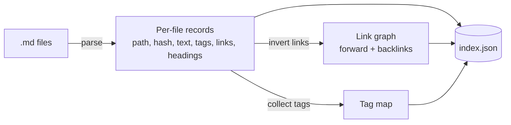
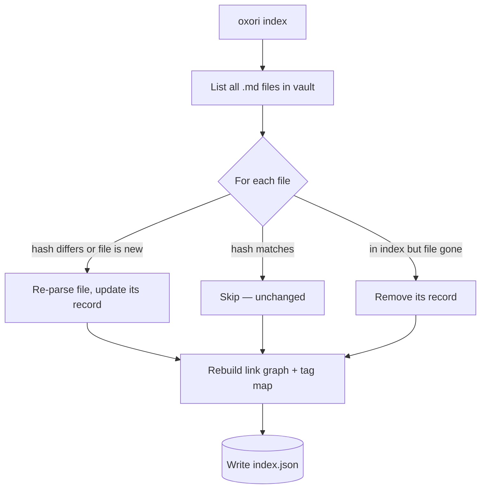

# Oxori — Low-Level Architecture

> Concrete view. Storage formats, parsing approach, change detection, module boundaries.
> Companion to ARCHITECTURE_HIGH_LEVEL.md (the conceptual shape). Decisions here resolve the items that doc left open.
> Phase 1 only. Embeddings/semantic are Phase 2.

---

## Resolved decisions

| Open item (from high-level) | Decision |
|---|---|
| Index physical format | **JSON** — text, non-binary, human-inspectable, structured for fast lookup. Not markdown (markdown index would still require scanning). |
| Full-text search method | Lookup over a structured JSON index built at index time. A search library can be introduced later if scale demands it; not needed for Phase 1. |
| Markdown parsing | Mature parser (**unified/remark**) for the body, plus a **thin Obsidian-syntax layer** for `[[...]]` links and `#tag` tags (these aren't standard markdown). |
| Change detection | **Content hash per file**, stored in the index. `index` recomputes hashes and reconciles only what changed. |
| CLI framework | A lightweight arg parser (e.g. commander/yargs) — small, no heavy framework. |

---

## On-disk layout

```
your-vault/                 # the /oxori vault (or an adopted Obsidian vault)
├── note-a.md               # source of truth — agents write these
├── note-b.md
├── sub/
│   └── note-c.md
└── .oxori/                 # Oxori's own area (derived, disposable)
    ├── index.json          # the searchable index
    └── config.json         # vault settings written by `init`
```

- Everything under `.oxori/` is **derived from the `.md` files** and can be deleted and rebuilt.
- The `.md` files never depend on `.oxori/`. Open the vault in Obsidian and `.oxori/` is just an ignored folder.

---

## The index (index.json)

A single JSON document. Conceptually three parts, all derived from the markdown:

**1. Per-file records** — one entry per markdown file:
- relative path
- content **hash** (for change detection)
- body **text** (normalized, so a keyword can be matched to this file)
- list of **tags** found in the file (`#tag`)
- list of **outgoing links** (`[[target]]`) found in the file
- file headings (for context in results)

**2. Link graph** — derived from all the outgoing links:
- forward links: file → files it points to
- **backlinks**: file → files that point to it
(Backlinks are just the forward links inverted; computed once at index time so search never has to compute them.)

**3. Tag map** — tag → list of files carrying it.

> Shape only — exact field names/nesting are an implementation detail. The point: everything search needs is precomputed here, so `search` never reads the `.md` files.



---

## Parsing

Two layers, run when a file is (re)indexed:

**Layer 1 — standard markdown (unified/remark).** Parses the file into a tree, from which Oxori extracts the body text and headings reliably (instead of fragile hand-written regex over raw markdown).

**Layer 2 — Obsidian syntax (thin custom step).** `[[wikilinks]]` and `#tags` are Obsidian conventions, not standard markdown, so a small dedicated step recognizes them:
- `[[target]]` and `[[target|alias]]` → an outgoing link to `target`
- `#tag` and `#nested/tag` → a tag, while ignoring `#` inside code blocks and headings

Output of parsing one file = `{ text, headings, tags[], links[] }`, which becomes that file's per-file record.

---

## Change detection (hash-based)

The index stores a content hash for every file. On `oxori index`:



- **New file**: no matching record → parse, add.
- **Changed file**: hash differs → re-parse, replace record.
- **Unchanged file**: hash matches → skip (the win — large vaults reindex cheaply).
- **Deleted file**: record exists but file is gone → drop record.
- After per-file reconciliation, the **link graph and tag map are rebuilt** from the current records (cheap, in-memory).

`init` is just this run against a fresh (or newly adopted) vault, plus writing `config.json`.

---

## Module boundaries (Phase 1)

Conceptual modules, mapping straight onto the high-level components:

| Module | Responsibility | Depends on |
|---|---|---|
| `cli` | parse argv, dispatch to a command, format output | commands |
| `commands` (`init`, `index`, `search`) | orchestrate one operation | engine pieces below |
| `parser` | `.md` → `{ text, headings, tags, links }` | remark + Obsidian layer |
| `indexer` | reconcile files ↔ index via hashes; build graph + tag map | parser, store |
| `store` | read/write `index.json` and `config.json` | filesystem |
| `search` | answer queries from the loaded index | store |

Dependencies point one way (cli → commands → engine → store → fs). `parser`, `indexer`, `search` hold no knowledge of the CLI, which keeps them unit-testable in isolation — matching the testing decision in DECISIONS.md.

---

## Command walkthroughs

**`oxori init`** — create `.oxori/`, write `config.json`, run a full index of the vault, write `index.json`. Adopting an existing Obsidian vault is the same path: the `.md` files are already there, Oxori just builds its `.oxori/` beside them.

**`oxori index`** — load `index.json`, run hash-based reconciliation (above), write it back. Called by an agent after it writes/edits markdown.

**`oxori search "<query>"`** — load `index.json`; match against full text (every file the term appears in), and/or follow the link graph (links & backlinks), and/or filter by tag; return matching files with enough context (path, headings, snippet) for the caller. Never touches the `.md` files.

---

## Phase 2 hook (not built now)

Embeddings attach as an extra section in `index.json` (or a sibling file under `.oxori/`) and an extra branch in `search`. Per-file records, parsing, hashing, and the two flows are unchanged. Keeping the index as plain JSON now means the semantic layer is an addition, not a rewrite.
